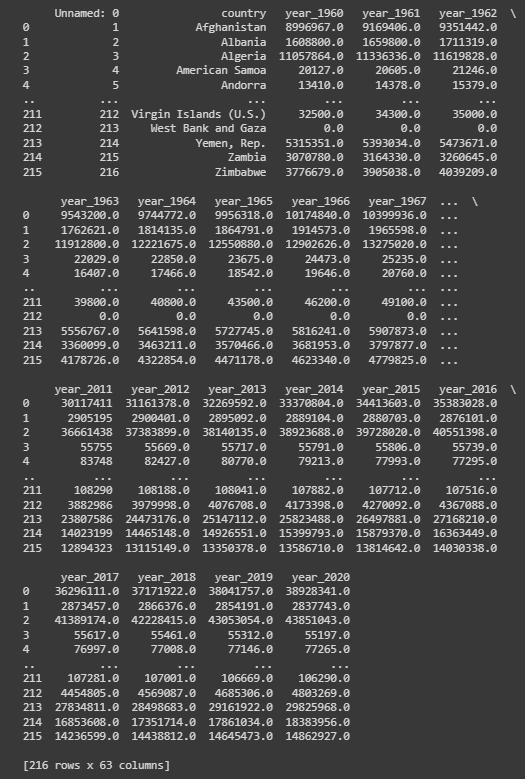
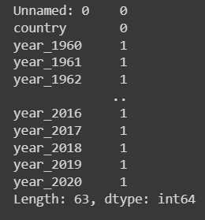
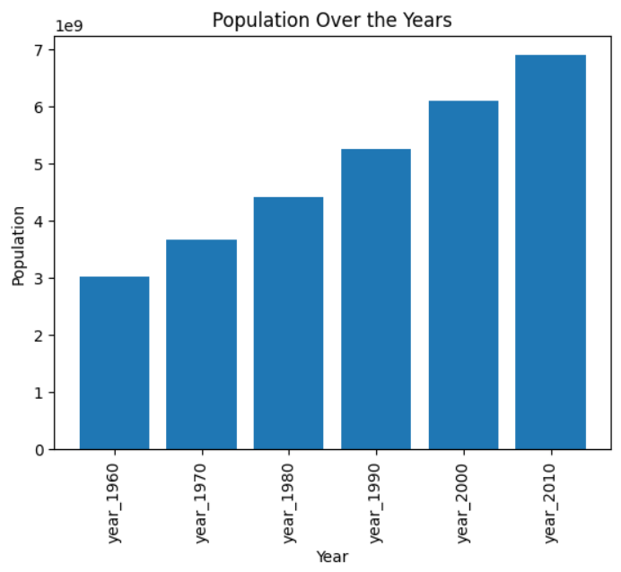
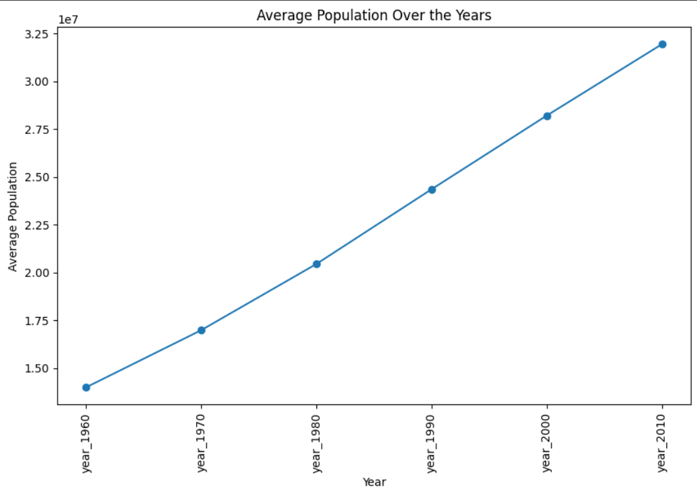
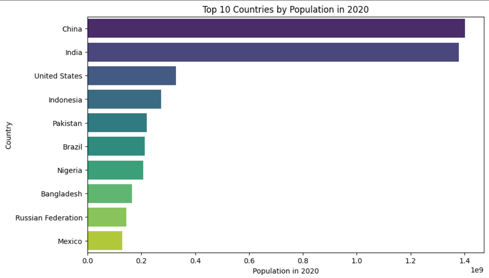

# Ex-10-Data-Process-

## AIM
To Perform Data Process on a complex dataset and save the data to a file. 

## Explanation
Data Process is most important process where the dataset is gone under data cleaning,feature selection,feature generation,data visualization etc to get new overview and pattern.

## ALGORITHM
### STEP 1
Read the given Data
### STEP 2
Clean the Data Set using Data Cleaning Process
### STEP 3
Apply Feature generation and selection techniques to all the features of the data set
### STEP 4
Apply data visualization techniques to identify the patterns of the data.

## CODE

Import and load dataset
```
import pandas as pd
import numpy as np
import matplotlib.pyplot as plt
import seaborn as sns
df = pd.read_csv("world_pop.csv")
print(df)
```
Data cleaning
```
print(df.isnull().sum())

df = df.drop_duplicates()

df = df.fillna(0)
```
Feature selection
```
cols_to_keep = ['country', 'year_1960', 'year_1970', 'year_1980', 'year_1990', 'year_2000', 'year_2010', 'year_2020']
df_selected = df[cols_to_keep].copy()
```
Feature generation
```
df_selected['Average_Growth_Rate'] = df_selected.iloc[:, 1:-1].mean(axis=1).pct_change() * 100
```
Exploratory data analysis
```
df_selected['Total_Population'] = df_selected.iloc[:, 1:].sum(axis=1)
```
Data visualization
```
years = df_selected.columns[1:-2]
total_population = df_selected[years].sum()
plt.bar(years, total_population)
plt.xlabel('Year')
plt.ylabel('Population')
plt.title('Population Over the Years')
plt.xticks(rotation='vertical')
plt.show()

plt.figure(figsize=(10, 6))
years = df_selected.columns[1:-2]
average_population = df_selected[years].mean()
plt.plot(years, average_population, marker='o')
plt.xlabel('Year')
plt.ylabel('Average Population')
plt.title('Average Population Over the Years')
plt.xticks(rotation='vertical')
plt.show()

df_selected['Total_Population_2020'] = df_selected['year_2020']
top_10_countries = df_selected.nlargest(10, 'Total_Population_2020')
plt.figure(figsize=(10, 6))
sns.barplot(x='Total_Population_2020', y='country', data=top_10_countries, palette='viridis')
plt.xlabel('Population in 2020')
plt.ylabel('Country')
plt.title('Top 10 Countries by Population in 2020')
plt.show()
```
# OUTPUT












# RESULT
Thus the data process on a complex dataset is performed successfully.

